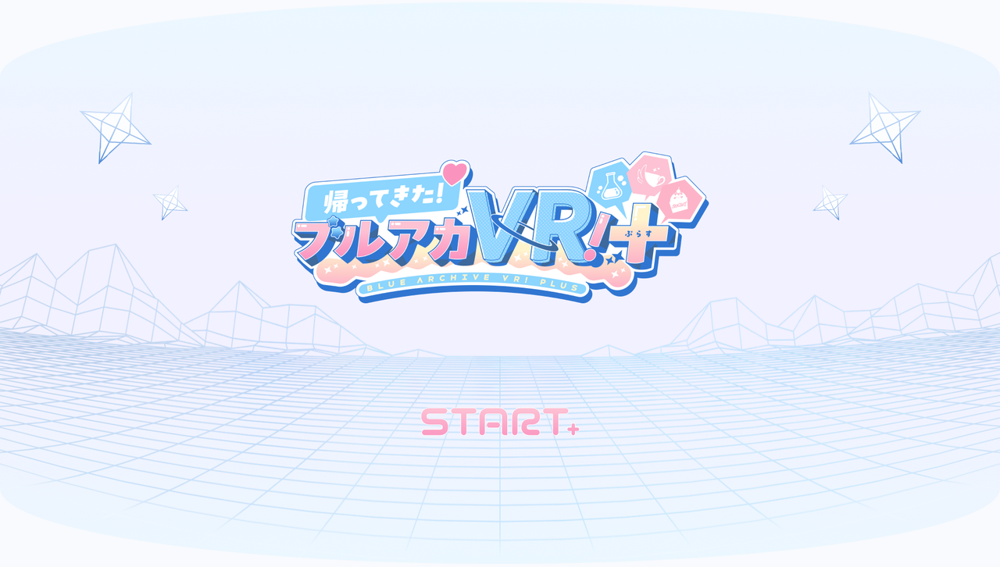
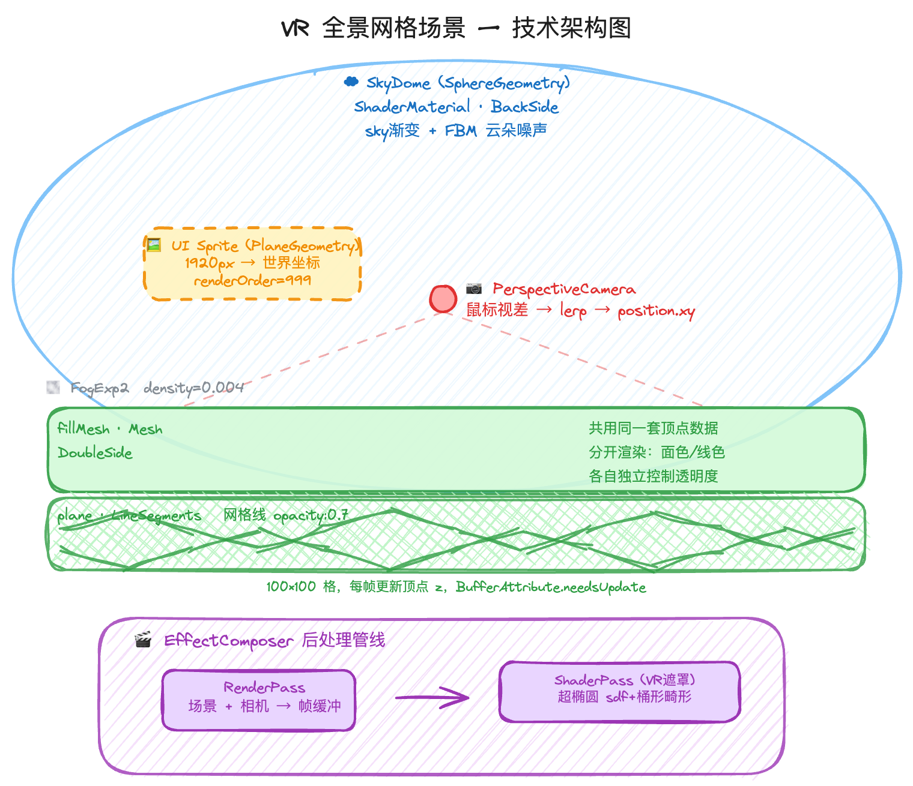
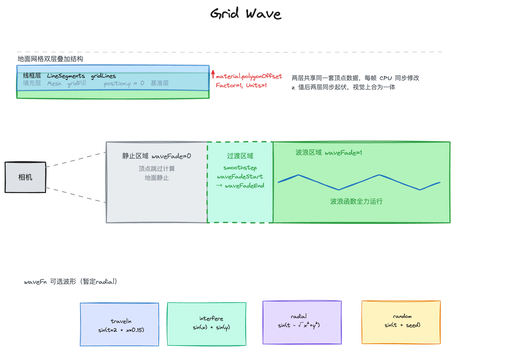
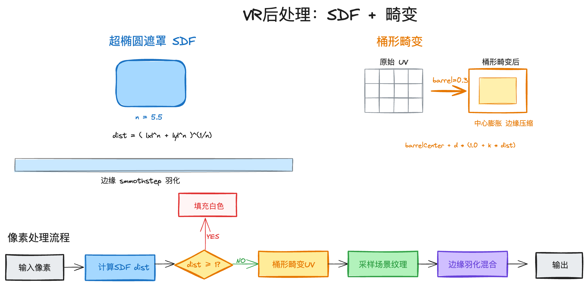
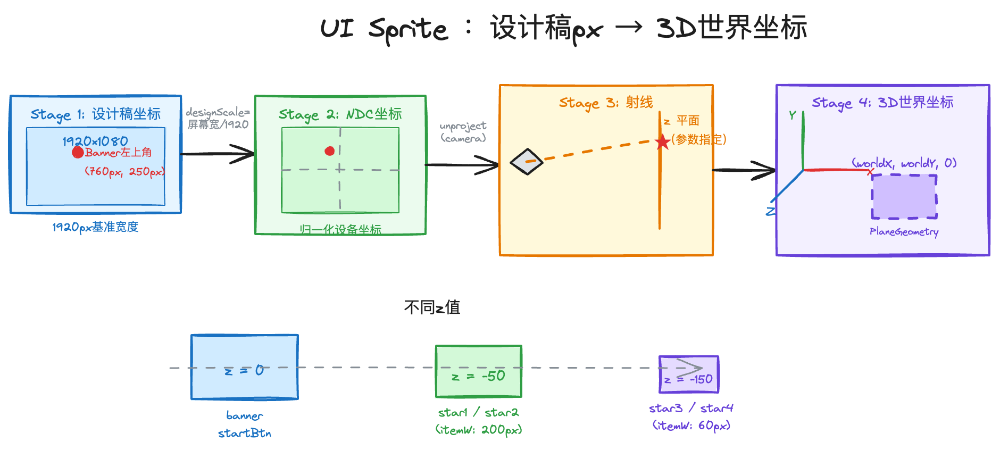
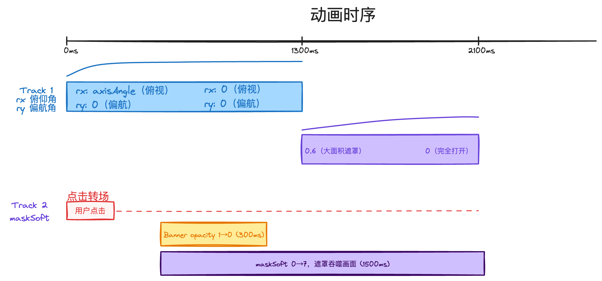

# 官网落地页 VR 场景技术方案



## 一、背景与目标

官网落地页需要一个具有沉浸感的 3D 场景作为视觉入口，吸引用户进入游戏。

目标效果：模拟 VR 头显视野的动态 3D 场景，包含程序化 SkyDome、动态地面波浪、UI 元素与入场动画，整体营造"进入VR世界"的沉浸感。

## 二、技术选型
- `three.js r160`

## 三、兼容性与性能目标

### 3.1 设备分级
| 设备 | 策略 |
|------|------|
| PC（桌面端） | 完整 WebGL 场景，目标 60fps 稳定 |
| 移动端 | 直接展示静态封面图

## 四、模块设计

### 4.1 场景分层结构



场景由四层叠加构成，从远到近依次渲染：天空球 → 地面网格 → UI Sprite → 后处理

### 4.2 SkyDome


#### Mesh 构建

`SphereGeometry` + `ShaderMaterial`，从内侧观察球面模拟天空：

```
side: BackSide      法线朝内，相机在球心看向内壁
depthTest: false    天空永远在最远处，不参与深度竞争
depthWrite: false   不写入深度缓冲，避免遮挡场景物体
```

#### 天空渐变

顶点着色器将世界空间方向传入 `vWorldDir`，片元着色器用 `dir.y` 判断当前像素仰角：

```
t    = clamp(dir.y × 0.5 + 0.5, 0, 1)   // 将 [-1,1] 映射到 [0,1]
t    = pow(t, uGradientPow)               // 控制渐变曲线形状
mask = smoothstep(uEdge0, uEdge1, t)      // 渐变区间
skyColor   = mix(uBottomColor, uTopColor, mask)
```

#### 云朵（FBM 噪声）

用透视投影将方向向量 `dir.xz / dir.y` 展开为 2D 平面 UV，再叠加 5 层 noise 形成 FBM：

```
uv  = dir.xz / (dir.y + 0.1) × uCloudScale
uv.x += uTime × uCloudSpeed               // UV 偏移驱动云朵飘动

n   = fbm(uv) × 0.6 + fbm(uv×2 + 3.7) × 0.4   // 两频段 FBM 叠加
horizon   = smoothstep(0, 0.25, dir.y)           // 地平线附近渐隐
cloudMask = smoothstep(1-coverage, 1-coverage+0.3, n) × horizon
```

最终混合：`mix(skyColor, uCloudColor, cloudMask × uCloudDensity)`

#### 可调 uniform

| uniform | 含义 | 默认值 |
|---------|------|--------|
| `uTopColor` / `uBottomColor` | 天空顶部 / 底部颜色 | `#EBF7FF` / `#F2F1FF` |
| `uEdge0` / `uEdge1` | 渐变区间起止 | `0.25` / `0.6` |
| `uGradientPow` | 渐变曲线指数 | `1.8` |
| `uCloudCoverage` | 云量 | `0.45` |
| `uCloudDensity` | 云不透明度 | `0.7` |
| `uCloudScale` | 云朵尺寸 | `2.5` |
| `uCloudSpeed` | 云朵飘动速度 | `0.2` |
| `uShowCloud` | 是否显示云朵 | `1.0` |

### 4.3 Grid Wave



#### 网格构建初始化

初始化时调用一次，构建双层网格对象和共享顶点数组。

**`verts[]`** — CPU 侧顶点逻辑数据，两层网格共享同一份：

```ts
type Vert = {
  x: number      // 水平坐标，初始化后固定不变
  y: number      // 纵深坐标，初始化后固定不变
  initZ: number  // 弯曲基准高度：sin(t×π) × curve，两端平、中间下凹
  z: number      // 当前帧高度 = initZ + 波浪偏移量，每帧覆盖写入
  seed: number   // Math.random() × 2π，固定随机种子，仅 random 波使用，偏移 sin 起点
  amp: number    // random(5~15)，每顶点随机振幅，让各顶点起伏幅度有差异
}
```

**`segPairs[]`** — 线段索引对 `[indexA, indexB]`，记录哪两个顶点构成一条网格线，初始化时构建一次，之后只读。

**`linesPosArr`** — `Float32Array`，线框层 GPU 缓冲，**非索引**，按线段展开存储：

```
长度 = segPairs.length × 6
布局：[ A.x  A.y  A.z  B.x  B.y  B.z ] [ ... ] ...
       ←────── 第0段 ──────→  ←─ 第1段 ─→
访问：linesPosArr[s*6 + 0~2] = 端点A xyz
      linesPosArr[s*6 + 3~5] = 端点B xyz
```

**`fillPosArr`** — `Float32Array`，填充面层 GPU 缓冲，**有索引**，每顶点去重存储一份：

```
长度 = verts.length × 3
布局：[ v0.x  v0.y  v0.z  v1.x  v1.y  v1.z  ... ]
       ←── 顶点0 ──→  ←── 顶点1 ──→
访问：fillPosArr[i*3 + 0~2] = 顶点i xyz
三角形拓扑由 setIndex(meshIndices) 固定，相邻格共享顶点不重复写，无需每帧更新
```

两个 Mesh 对象共享同一套 `verts[]` 逻辑数据：

| 对象 | 类型 | 材质 | Z-fighting 处理 |
|------|------|------|---------|
| `gridLines` | `LineSegments` | `LineBasicMaterial` `#88b0d8` | 无需处理（线段不写深度面） |
| `gridFill` | `Mesh` | `MeshBasicMaterial` `#dde8f8` | `polygonOffset: true` `factor/units: 1`（深度后移） |


#### 顶点缓冲同步

波浪动画在 CPU 侧修改 `verts[].z`，再分别写回两个 GPU 缓冲：

```
每帧数据流：
  verts[i].z = initZ + waveFn(t, v) × amp × waveAmp × waveFade
                  ↓                            ↓
            linesPosArr                   fillPosArr
          （线框层，非索引）             （填充面层，有索引）
```

**写回 `linesPosArr`**（非索引，按线段展开，每段两端点各存一份）

```
写入：linesPosArr[s*6 + 0~2] = verts[segPairs[s][0]].xyz   ← 端点 A
      linesPosArr[s*6 + 3~5] = verts[segPairs[s][1]].xyz   ← 端点 B
```

**写回 `fillPosArr`**（有索引，每顶点去重存一份，三角形拓扑固定无需每帧更新）

```
写入：fillPosArr[i*3 + 0~2] = verts[i].xyz
```

#### Wave Fade 平滑过渡

每帧对每个顶点计算新的 `z`：

```
v.z = v.initZ + waveFn(t, v) × v.amp × waveAmp × waveFade
```

`waveFade` 由 smoothstep 根据顶点的纵深位置 `v.x` 计算得出：

```
v.x:       waveFadeStart ──────────────── waveFadeEnd
waveFade:       0        →  S型缓入缓出  →      1
             （静止）                        （全力起伏）
```

waveFade = 0 的顶点直接跳过波形计算，节省 CPU 开销。

#### 可选波形（运营选择后固化正式版）

| 波形 | 视觉效果 | 公式特征 |
|------|----------|----------|
| traveling | 整个平面像传送带朝一个方向推进 | `sin(t×2 + x×0.15)` |
| interfere | 两列不同方向的波叠加，产生棋盘状驻波图样 | 两个 sin 函数加权叠加 |
| radial | 从中心向外扩散，像水面投入石子 | `sin(t×1.5 - √(x²+y²)×0.1)` |
| random | 每个顶点独立抖动，整体像颗粒感震动 | `\|sin(t + seed)\|` |

### 4.5 后处理：VR 遮罩 + 畸变



VR 遮罩和桶形畸变都是全屏像素级操作，无法附加在场景中某个 mesh 上实现。需要在场景渲染完成后，把整张画面作为纹理再处理一次：

```
RenderPass  →  场景渲染到离屏纹理 tDiffuse
ShaderPass  →  读取 tDiffuse，做遮罩 + 畸变后输出到屏幕
```

#### 超椭圆遮罩

用超椭圆 SDF 计算每个像素到遮罩边界的距离：

```
d    = abs(uv - 0.5) / vec2(maskRX, maskRY)
dist = pow(|d.x|ⁿ + |d.y|ⁿ, 1/n)          // n=2 标准椭圆，n 越大越方
mask = smoothstep(1 - maskSoft, 1.0, dist)  // 边界羽化
```

`maskSoft` 控制羽化宽度：入场动画从 `0.6→0` 产生"镜片聚焦"效果，点击转场从 `0→7` 遮罩向外扩张吞噬画面。

#### 桶形畸变

模拟 VR 凸透镜效果，中心区域膨胀、边缘压缩：

```
d       = (uv - center) / scale              // 归一化偏移
distUV  = center + d × (1 + k × length(d))  // k>0 桶形，k<0 枕形
color   = texture2D(tDiffuse, distUV)        // 用畸变后的 UV 采样
```

#### 每像素处理流程

```
计算 dist（超椭圆 SDF）
  │
  ├─ dist ≥ 1  →  填充 maskColor，返回
  │
  └─ dist < 1  →  对 UV 做桶形畸变 → 采样 tDiffuse
                   → smoothstep 羽化混合 maskColor
```

#### 可调 uniform

| uniform | 含义 | 默认值 |
|---------|------|--------|
| `maskRX` / `maskRY` | 遮罩横 / 纵轴半径 | `0.5` |
| `maskN` | 超椭圆指数（圆角程度） | `5.5` |
| `maskSoft` | 边缘羽化宽度 | `0.6` |
| `barrel` | 畸变强度（`>0` 桶形，`<0` 枕形） | `0.3` |
| `barrelCenter` | 畸变中心点 | `(0.5, 0.5)` |

---

### 4.6 UI Sprite 系统



#### 设计稿坐标 → 3D 世界坐标

```
响应式缩放：scale = innerWidth / 1920

NDC坐标：ndcX = (dsX × scale / innerWidth) × 2 - 1

反投影：ndcPoint.unproject(camera)  

世界坐标：worldX = camera.x + (z - camera.z) / rayDir.z × rayDir.x
```

无论屏幕尺寸如何变化，元素视觉位置始终与设计稿对应。不同元素设置不同 `z` 值，透视投影自动产生近大远小的层次感。

#### Mesh 构建

每个 Sprite 是一个 `PlaneGeometry` + `MeshBasicMaterial`（透明贴图）：

```
w = worldX(left + itemW) - worldX(left)   // 由设计稿宽度反算世界宽度
h = w / (img.width / img.height)          // 保持贴图宽高比
position = (x0 + w/2, y0 - h/2, z)       // 左上角对齐设计稿坐标
renderOrder = 999                         // 始终渲染在场景最上层
```

### 4.7 动画系统



#### 入场动画

页面加载后自动播放，两段串联：

```
t=0ms    相机 rotation.x（俯仰角）: axisAngle → 0，时长 1300ms，Quadratic.Out
         相机 rotation.y（偏航角）: 0 → 0（当前保持正前方，预留偏航支持）
                                    （俯视视角平滑转正）
t=1300ms maskSoft: 0.6 → 0，时长 800ms，Quadratic.InOut
                                    （遮罩从模糊到清晰，"镜片聚焦"）
t=2100ms 入场完成
```

#### 点击转场

点击 Start 按钮后，遮罩从中心向外扩张覆盖全屏，期间切换场景，再从新页面退出遮罩：

```
click
  │
  ├─ delay 400ms → banner opacity: 1 → 0，300ms（等待点击视觉反馈后淡出）
  │
  ├─ maskSoft: 0 → 7，1500ms          （遮罩向外扩张，逐渐吞没整个画面）
  │                    ↓
  │              画面被完全覆盖        （此时切换路由 / 跳转页面）
  │                    ↓
  └─ 新页面：maskSoft: 7 → 0          （遮罩从中心向外收缩，新场景逐渐显现）
```