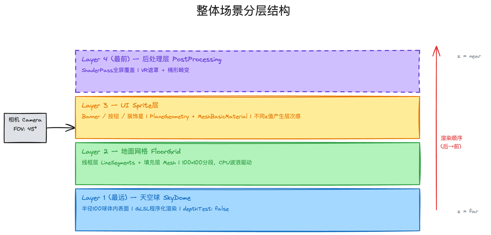
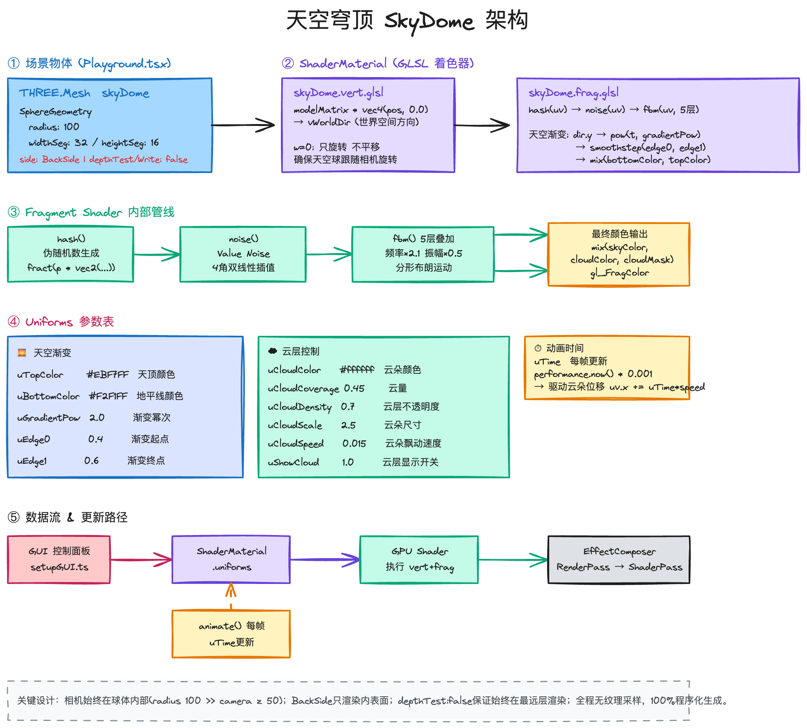
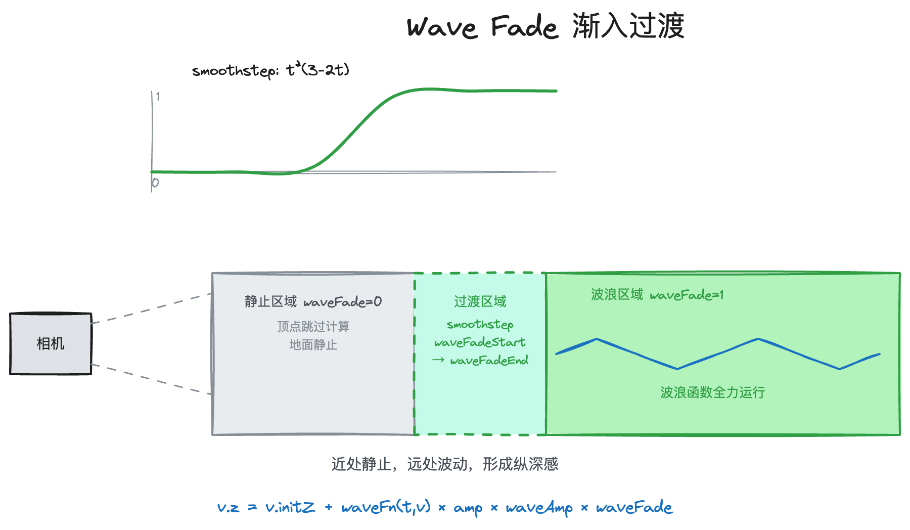

# 官网落地页 VR 场景技术方案

## 一、背景与目标

官网落地页需要一个具有沉浸感的 3D 场景作为视觉入口，吸引用户进入游戏。

目标效果：模拟 VR 头显视野的动态 3D 场景，包含程序化天空、动态地面波浪、UI 元素与入场动画，整体营造"进入游戏世界"的沉浸感。

交付流程：开发实现 Playground Demo → 运营通过 dat.GUI 调整视觉参数确认效果 → 开发按确认参数落地正式页面并移除调试面板 → 上线。

---

## 二、技术选型
threejs r160

---
## 三、模块设计

### 3.1 场景分层结构

场景由四层叠加构成，从远到近依次渲染：天空球 → 地面网格 → UI Sprite → 后处理（全屏覆盖）。

### 3.2 SkyDome

配合自定义着色器可以在运行时随意调整颜色和云朵。

SphereGeometry 关键处理：
1. `side: BackSide`
2. `depthTest: false`
3. `pow + smoothstep`

Sky 关键处理：
1. `dir.xz / dir.y`
2. 叠加5层噪声形成FBM
3. 地平线渐隐
4. UV偏移飘动

### 3.3 地面网格

Three.js 的 `LineSegments` 只能画线，`Mesh` 只能画面。要同时呈现"有颜色的地面 + 上面的网格线"，必须用两个对象叠加。线框层的 `position.y` 比填充层高 0.1，防止两层共面时深度缓冲精度不足导致闪烁（z-fighting）。

**顶点结构：** 每个顶点存储 6 个属性——`x/y` 固定不变，`initZ` 是由 `sin(t×π)×curve` 决定的弯曲基准值（两端平、中间下凹），`z` 是每帧由波浪函数动态修改的当前高度，`phase` 和 `amp` 是随机化参数，使各顶点波动不同步、幅度有差异，避免整体机械感。

**每帧更新流程：** CPU 遍历全部顶点，修改 `v.z`，写回 `Float32Array`，标记 `needsUpdate = true`，GPU 读取新数据完成渲染。

**Wave Fade 的作用：**

> 图解：[diagrams/03-wave-fade.excalidraw](diagrams/03-wave-fade.excalidraw)

靠近相机的地面静止，远处地面起伏，形成"走向波浪"的视觉纵深感，而非整块地面同时波动。通过 smoothstep 公式 `t²(3-2t)` 在 `waveFadeStart → waveFadeEnd` 区间平滑过渡，边界处一阶导数为 0，无折角感。

---

### 3.4 波浪动画

提供 5 种波形，运营选择后固化到正式版本：

| 波形 | 视觉效果 | 公式特征 |
|------|----------|----------|
| traveling | 整个平面像传送带朝一个方向推进 | `sin(t×2 + x×0.15)` |
| interfere | 两列不同方向的波叠加，产生棋盘状驻波图样 | 两个 sin 函数加权叠加 |
| radial | 从中心向外扩散，像水面投入石子 | `sin(t×1.5 - √(x²+y²)×0.1)` |
| random | 每个顶点独立抖动，整体像颗粒感震动 | `|sin(t + phase)|` |
| **noise** | **最自然的有机起伏，推荐正式版本使用** | Simplex Noise 3D |

---

### 3.5 后处理：VR 遮罩 + 桶形畸变

> 图解：[diagrams/02-vr-postprocess.excalidraw](diagrams/02-vr-postprocess.excalidraw)

**为什么需要后处理？** VR 遮罩要覆盖在整张画面最上层，桶形畸变要对整张画面重新采样——两者都是全屏像素级操作，无法附加在场景中的某个 mesh 上实现。必须在场景渲染完成后，把整张画面作为一张纹理再处理一次。

**超椭圆遮罩：** 公式 `pow(|dx|ⁿ + |dy|ⁿ, 1/n)` 在 n=2 时是标准椭圆，n 越大越接近矩形，n=5.5 得到 VR 头显镜片的方圆形边框。边界处用 smoothstep 羽化，`maskSoft` 参数控制羽化宽度，入场动画通过驱动此值产生"镜片聚焦"效果。

**桶形畸变：** 模拟 VR 凸透镜光学效果，中心膨胀、边缘压缩。对每个像素将 UV 坐标向边缘方向偏移，偏移量与离中心距离成正比（非线性），使中心区域采样范围扩大、边缘向外偏移。

每个像素的处理流程：计算 SDF dist → dist ≥ 1 直接填充白色返回 → dist < 1 做桶形畸变后采样场景纹理 → 边界处 smoothstep 羽化混合。

**可调参数：**

| 参数 | 含义 | 默认值 |
|------|------|--------|
| maskRX / maskRY | 遮罩横/纵轴半径 | `0.5` |
| maskN | 超椭圆指数（圆角程度） | `5.5` |
| maskSoft | 边缘羽化宽度 | `0.6` |
| barrel | 畸变强度（>0 桶形，<0 枕形） | `0.3` |

---

### 3.6 UI Sprite 系统

> 图解：[diagrams/05-ui-sprite-coords.excalidraw](diagrams/05-ui-sprite-coords.excalidraw)

**核心问题：设计师给的是设计稿像素坐标，Three.js 需要 3D 世界坐标，怎么转换？**

以 1920px 为基准宽度，将设计稿像素坐标经过响应式缩放 → 转为 NDC 归一化坐标 → 通过相机反投影发射射线 → 与指定深度的 z 平面求交，得到 3D 世界坐标。无论屏幕尺寸如何变化，元素视觉位置始终与设计稿对应。

不同元素设置不同 `z` 值（Banner z=0，装饰星 z=-50、z=-150），透视投影自动产生近大远小的层次感，无需手动计算大小。

hover/click 通过 Raycaster 射线检测实现，每次 mousemove 向场景发射一条射线，检测与哪个 Sprite 相交，精确触发 `onHover` / `onHoverOut` / `onClick` 回调，回调内用 TWEEN 驱动动画。

---

### 3.7 动画系统

> 图解：[diagrams/04-entry-animation.excalidraw](diagrams/04-entry-animation.excalidraw)

所有动画统一通过 `TWEEN.Group` 管理（而非全局 TWEEN），可对任意 JS 对象的数值属性做插值，包括 shader uniform、mesh.scale、material.opacity，销毁时精确清理不污染其他页面。

**入场动画（两段串联）：**
- `t=0ms`：相机从俯视（`rotation.x=1.2`）平滑转正（`=0`），时长 1300ms，Quadratic.Out（先快后慢，自然减速）
- `t=1300ms`：VR 遮罩从 `maskSoft=0.6` 渐变到 `0`，时长 800ms，产生"镜片慢慢聚焦"效果
- `t=2100ms`：入场完成

**点击转场：**
- delay 400ms（等待点击视觉反馈）后，Banner opacity `1→0`（300ms）
- 同时 `maskSoft` `0→7`（1500ms），遮罩从中心向外扩张吞噬整个画面，产生"进入 VR 世界"的隧道感

---

## 五、正式落地工作量

| 工作项 | 说明 | 估算 |
|--------|------|------|
| 按运营确认参数固化配置 | 将 dat.GUI 调试参数替换为硬编码默认值，移除调试面板 | 0.5 天 |
| 替换正式 UI 素材 | Banner、按钮、装饰图等切图替换 | 0.5 天 |
| 点击后的页面跳转逻辑 | onClick 回调接入路由/跳转 | 0.5 天 |
| 响应式适配 | 窗口 resize 已处理，需确认移动端布局比例 | 1 天 |
| 性能测试与优化 | 见风险章节 | 1～2 天 |
| **合计** | | **3.5～4.5 天** |

> 以上不含运营调参时间，调参结果确认后方可开始落地。

---

## 六、风险与降级方案

### 风险 1：移动端性能

**原因：** 地面网格每帧在 CPU 侧更新 10201 个顶点（101×101），移动端低端机可能帧率不足。

**应对（按优先级）：**
1. 降低网格分段数：`SEG_X/SEG_Y` 从 100 降至 50，顶点数减少至 1/4
2. 将波浪计算迁移到顶点着色器（GPU），彻底消除 CPU 瓶颈
3. 最终降级：移动端禁用波浪动画，地面静止展示

### 风险 2：WebGL 不支持

**应对：** 检测 WebGL 可用性，不可用时降级为静态图或视频背景。

### 风险 3：运营调参超出视觉边界

**应对：** dat.GUI 中对高风险参数（畸变强度、遮罩形状）设置数值范围上限，防止调出异常视觉效果。

---

## 七、参数确认清单（交运营）

运营通过 Playground Demo 的 dat.GUI 面板调整以下参数并截图/录屏确认：

**Sky 面板**
- 顶部/底部颜色、渐变区间（edge0/edge1）、渐变曲线指数
- 是否显示云朵、云量、云密度、云速度

**Wave 面板**
- 波形类型（traveling / interfere / radial / random / noise）
- 波浪速度、幅度倍数、渐入起点/终点

**Buffer 面板**
- 地面弯曲程度、地面 Z/Y 位置

**VR 面板**
- 遮罩横纵轴、圆角程度、边缘羽化、畸变强度

**Camera 面板**
- 俯仰角、视差偏移范围

**UI 素材（需设计提供）**
- Banner、按钮、装饰星等切图（PNG 透明底）
- 各元素在 1920px 设计稿中的坐标和尺寸
